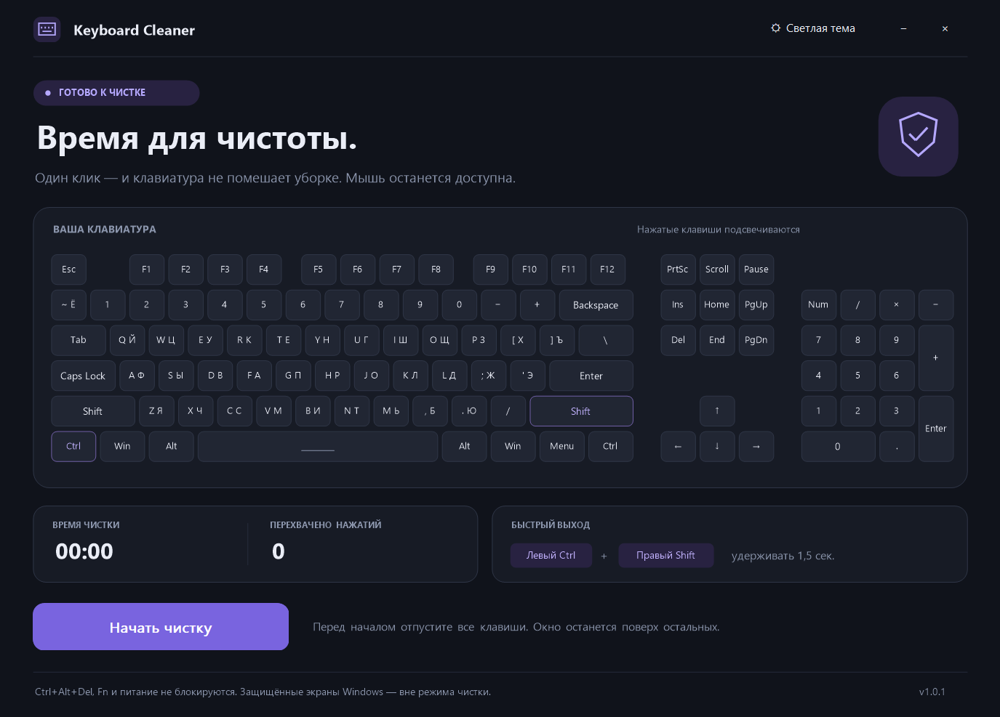

# Keyboard Cleaner

Небольшое приложение для чистки клавиатуры на Windows 10/11 x64.
Показывает нажатые клавиши, время чистки и счётчик нажатий.
Тёмная тема по умолчанию, светлая переключается в заголовке.

## Запуск

Скачайте **KeyboardCleaner.exe** из [релизов](https://github.com/Laynholt/KeyboardCleaner/releases)
и запустите. Установка и дополнительные DLL не нужны.

Отпустите все клавиши и нажмите **«Начать чистку»**. Мышь и тачпад продолжат работать.
Для выхода нажмите **«Завершить чистку»** или удерживайте **левый Ctrl + правый Shift 1,5 секунды**.

## Ограничения

Это фильтр ввода `WH_KEYBOARD_LL`, а не отключение устройства или драйвер.
**Ctrl+Alt+Del, защищённые экраны Windows, кнопка питания и аппаратные Fn-функции
не блокируются.** Игры с Raw Input, программы администратора, сторонние перехватчики
и нестандартные драйверы ввода требуют отдельной ручной проверки: абсолютной блокировки
всех путей ввода приложение не обещает. Другие клавиатуры на текущем рабочем столе
тоже попадают под фильтр — выбор конкретного устройства не предусмотрен.

Hook работает в отдельном потоке, независимо от отрисовки. При задержке hook Windows
может снять его без уведомления; это ограничение API, поэтому приложение не следует
использовать как защиту от доступа. Если после перехода на защищённый экран подсветка
застыла или завершение ждёт уже отпущенную клавишу, закройте окно мышью и запустите снова.
При завершении процесса Windows также убирает его hook.

Документация Microsoft: [LowLevelKeyboardProc](https://learn.microsoft.com/en-us/windows/win32/winmsg/lowlevelkeyboardproc).

## Сборка

Нужны CMake 3.24+, Visual Studio Build Tools с C++ и Windows SDK.
Скачайте или клонируйте [Win32 Custom Widgets](https://github.com/Laynholt/win32-custom-widgets/tree/master)
и положите папку `win32-custom-widgets` рядом с папкой `KeyboardCleaner`.
При скачивании ZIP переименуйте папку `win32-custom-widgets-master` в `win32-custom-widgets`.
Библиотека подключается через CMake из `../win32-custom-widgets` и включается в EXE при сборке.
В PowerShell из папки `KeyboardCleaner`:

```powershell
cmake -S . -B build -G "Visual Studio 18 2026" -A x64
cmake --build build --config Release --parallel
ctest --test-dir build -C Release --output-on-failure
```

Для Visual Studio 2022 используйте генератор `Visual Studio 17 2022` и новую папку сборки.
Другой путь к библиотеке: `-DWCW_SOURCE_DIR="F:/path/to/win32-custom-widgets"`.
EXE создаётся в `build/bin/Release/KeyboardCleaner.exe`. MSVC runtime статически включён.

## Проверки

- `KeyboardStateTests`: блокировка down/up, повторы, удержание/отмена сочетания,
  сторона модификаторов, восстановление ввода, цифровой блок без Num Lock.
- `KeyboardHookTests`: настоящий hook и `SendInput`, отдельное окно-получатель,
  отсутствие переданных событий при чистке, выход мышью/сочетанием, повторный запуск и закрытие.
  Нужен разблокированный интерактивный рабочий стол: тест на несколько секунд перехватывает ввод.
- `tests/ui_smoke.py`: запуск реального приложения, проверка WCW-кнопок, обе темы,
  подсветка, завершение с зажатой клавишей, минимальный размер, второй экземпляр,
  обработка уведомлений о блокировке и сне, закрытие при активном hook.
  Нужны Python и Pillow; запуск: `python tests/ui_smoke.py`.
- `UpdateTests`: числовое сравнение версий, неправильные/отсутствующие релизы,
  допустимые URL, SHA256SUMS, известный SHA-256 и проверка x64 PE перед установкой.
- `tests/update_install_smoke.py`: настоящая атомарная замена тестовых EXE,
  запуск новой версии, откат при сбое запуска и повторная проверка хэша после
  изменения файла. Проверяются пути с пробелами, кириллицей и апострофами.
- `tests/update_ui_smoke.py`: отдельная тестовая сборка с локальными файлами вместо
  HTTP проверяет отсутствие стрелки при ошибках, стрелку и кастомный tooltip,
  отказ при неверном хэше и полный сценарий скачивания/замены/перезапуска.
  В обычную сборку тестовый транспорт не включён.

Результаты проверены сборкой Release на Windows 10 x64. UI smoke-тест создаёт снимки
только окна приложения в `out/previews/`. Сон и блокировка проверены отправкой
соответствующих уведомлений приложению, без фактического сна или блокировки компьютера.
Регрессия рамки проверяется при WM_NCACTIVATE/WM_NCPAINT и скрытии/возврате окна:
по краям остаётся цвет приложения вместо стандартного серого бордюра.
Скругления кнопки чистки сохраняют сглаженные полупрозрачные края без ступенчатой оконной маски;
UI smoke проверяет наличие этих промежуточных цветов на внешнем крае кнопки.
Физические Fn-клавиши, игры с Raw Input и ввод в повышенные процессы не проверялись.

JSON разбирается `nlohmann/json`, взятым из предоставленного BoostyDownloader.
Его MIT-лицензия и сведения об авторстве сохранены в заголовке `third_party/nlohmann/json.hpp`.


